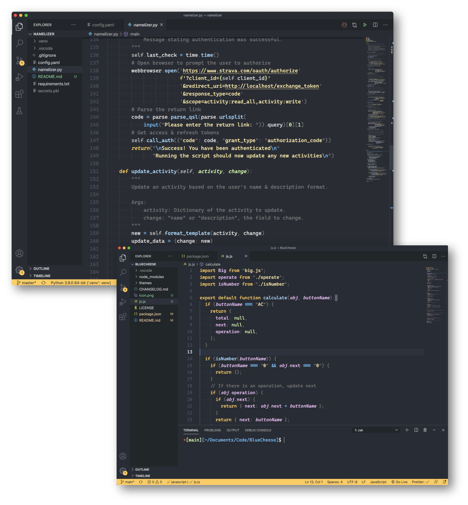

---

## Archived September 24th, 2021

I thought making a theme was going to be simple; I was wrong!
A lot of very time-consuming specific tweaking.
I have a lot of respect for people who write and maintain themes.
Feel free to fork or use the palette.

---

# Blue Cheese 🧀

A minimal, clean, elegant dark theme for Visual Studio Code. Based off the beloved [One Dark Pro theme](https://marketplace.visualstudio.com/items?itemName=zhuangtongfa.Material-theme) with completely revamped colors.

